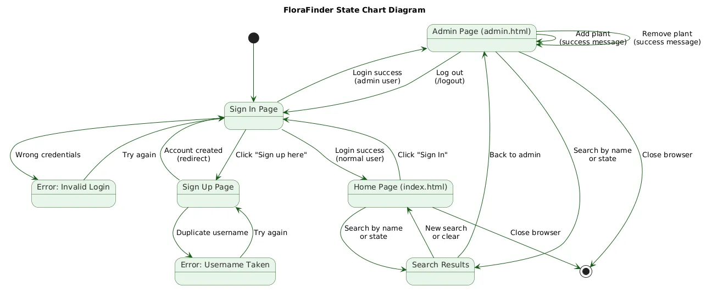
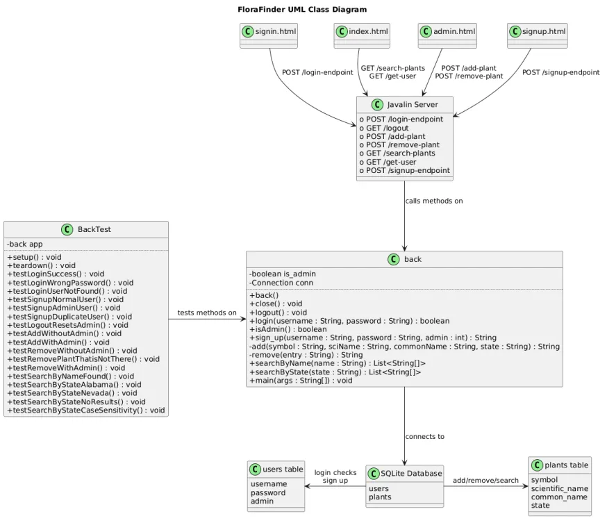
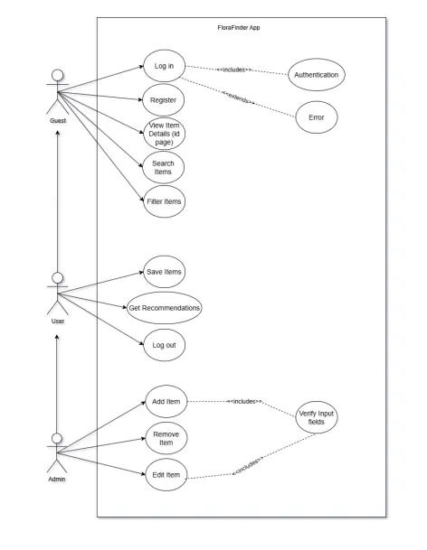

# Developer Documentation

## Overview

FloraFinder is a full-stack web application that provides a searchable and filterable catalogue of botanical plant entries. It supports two distinct user roles: regular users who can browse and search the catalogue, and administrators who can manage plant entries.

---

## Development Stack

| Aspect          | Technology               |
| --------------- | ------------------------ |
| Backend         | Java (Javalin framework) |
| Database        | SQLite (via JDBC)        |
| Frontend        | HTML, CSS, JavaScript    |
| Testing         | JUnit 5                  |
| Version Control | GitHub                   |
| Communication   | Discord                  |

---

## System Architecture

FloraFinder follows a three-tier architecture:

- **Frontend** - HTML pages include (`index.html` for the catalogue, `admin.html` & `admindash.html` for admin view and operations, `signin.html`, `signup.html`, and `collection.html` for the wishlist). Pages send HTTP requests to the Javalin server and render responses dynamically via JavaScript.
- **Backend** - `back.java` contains the Javalin HTTP server, all route handlers, and the core logic methods. It processes login, registration, plant search/filter, admin add/remove, and password reset operations.
- **Database** - a SQLite file accessed via JDBC. All reads and writes use `PreparedStatement`s to prevent SQL injection. An SQLite instance (`jdbc:sqlite::memory:`) is used for unit testing to isolate tests from the live database.

Request flow: a browser page sends an HTTP request -> Javalin routes it to the appropriate handler -> `back.java` executes the relevant method -> the result is returned to the frontend as a text or JSON response.

---

## Database Schema

### `users` table

| Column     | Type         | Description                         |
| ---------- | ------------ | ----------------------------------- |
| `id`       | INTEGER (PK) | Auto-incremented user identifier    |
| `username` | TEXT         | Unique login name                   |
| `password` | TEXT         | User password (stored as text)      |
| `admin`    | INTEGER      | 0 = regular user, 1 = administrator |

### `plants` table

| Column              | Type | Description                               |
| ------------------- | ---- | ----------------------------------------- |
| `symbol`            | TEXT | Unique plant identifier code (e.g., ACRU) |
| `scientific_name`   | TEXT | Full scientific/Latin name                |
| `common_name`       | TEXT | Common English name                       |
| `state`             | TEXT | Native region or state                    |
| `light_requirement` | TEXT | e.g., Full Sun, Partial Shade             |
| `water_requirement` | TEXT | e.g., Low, Moderate, High                 |
| `plant_type`        | TEXT | e.g., Tree, Herb, Shrub                   |
| `description`       | TEXT | Detailed plant description                |

---

## Key Methods

The following methods form the core of the backend:

| Method                                                                | Description                                                                                                  |
| --------------------------------------------------------------------- | ------------------------------------------------------------------------------------------------------------ |
| `login(username, password)`                                           | Validates credentials; returns true/false. Sets session state on success.                                    |
| `sign_up(username, password, isAdmin)`                                | Registers a new user. Throws SQLException on duplicate username.                                             |
| `logout()`                                                            | Clears the current session and resets the isAdmin flag.                                                      |
| `isAdmin()`                                                           | Returns true if the currently logged-in user has admin privileges.                                           |
| `add(symbol, sci_name, common_name, state, light, water, type, desc)` | Inserts a new plant record. Requires admin authentication.                                                   |
| `remove(common_name)`                                                 | Deletes a plant entry by common name. Requires admin authentication.                                         |
| `searchWithFilters(name, state, light, water, type)`                  | Returns matching plant records. Supports partial/case-insensitive name match and any combination of filters. |
| `reset_password(username, old_password, new_password)`                | Updates password after verifying old credentials. Rejects if new password equals old.                        |

---

## HTTP API Endpoints

All routes are handled by the Javalin server in `back.java`. The following endpoints are exposed:

| Method | Endpoint           | Description                                    | Auth Required |
| ------ | ------------------ | ---------------------------------------------- | ------------- |
| `POST` | `/login-endpoint`  | Authenticates user; sets session               | No            |
| `POST` | `/signup-endpoint` | Registers new user account                     | No            |
| `GET`  | `/logout`          | Invalidates session; redirects to signin       | Yes           |
| `POST` | `/add-plant`       | Adds new plant to catalogue                    | Admin         |
| `POST` | `/remove-plant`    | Removes plant by common name                   | Admin         |
| `GET`  | `/search-plants`   | Returns JSON array of matching plants          | No            |
| `GET`  | `/get-user`        | Returns current username; 401 if not logged in | Yes           |
| `GET`  | `/is-admin`        | Returns `'true'`/`'false'` for current session | Yes           |
| `POST` | `/reset-password`  | Resets user password                           | No            |

---

## UML Diagrams

### State Chart

### Class Diagram

### Use Case Diagram

